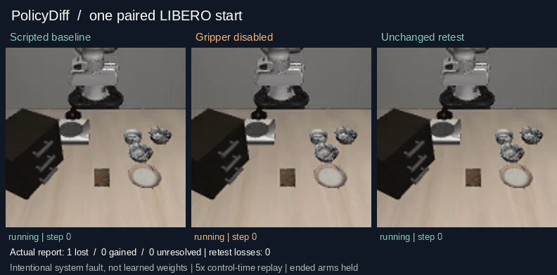

# PolicyDiff

**What did a robot-policy update improve, break, or leave untested?**

PolicyDiff compares a baseline with its updated policy on the same declared
tasks and starting states. See lost successes, new successes and missing evidence
instead of relying on an average score. An unchanged-baseline retest shows how
much the baseline itself varies.

Local-first, Python 3.10+, no runtime dependencies for analysis. This is a
developer preview—not a leaderboard, safety certificate or automatic release gate.

## See it run



Real LIBERO/MuJoCo physics, using a **scripted action replay—not a trained model**.
The candidate deliberately keeps its gripper open. PolicyDiff runs all three
arms on the same start, checks the recorded identities and reports the difference.
The animation is a checked post-run replay at 5× control time, not live inference.
The actual report: **1 lost case, 0 gained, 0 unresolved; unchanged retest preserved.**

[Reproduce the recording and inspect its evidence](docs/SIMULATION_DEMO.md).
This one-start demonstration shows the integration working; it does not measure
fine-tuning, generalization, model quality or stable physical success.

## Try it in 30 seconds

From the repository root, no simulator or model required:

```sh
export PYTHONPATH=src
python3 -m policydiff demo --output demo-output
python3 -m policydiff triage \
  --manifest demo-output/manifest.input.json \
  --episodes demo-output/episodes.input.csv \
  --group-by task --format markdown
```

Open `demo-output/report.md` for the full report. This quickstart generates
**synthetic data**, separate from the recorded simulation above. Output directories
must be new. Install with `pip install .` to use the `policydiff` command directly;
building from source requires setuptools 68+ and wheel.

## Use your own evaluations

Declare tasks, conditions and planned cases in a manifest; export one episode
row per revision/case using the [input schema](SCHEMA.md). Keep failures,
interruptions and missing cases visible. Then:

```sh
policydiff validate --manifest manifest.json --episodes episodes.csv
policydiff compare --manifest manifest.json --episodes episodes.csv --output review
policydiff verify --bundle review
```

The bundle contains JSON and Markdown reports, exact input snapshots and a hash
receipt. Existing logs need a schema-compatible export: PolicyDiff cannot recover
unrecorded pairing or provenance by inventing hashes.

Have a compatible local LIBERO policy? The optional runner handles execution:

```sh
policydiff catalog --suite libero_object
policydiff evaluate --config evaluation.json --output evaluation --allow-local-code
```

See the [adapter and execution guide](EXECUTION.md). Supported today: Linux,
LIBERO + Panda, and one explicit RGB/proprioception/action interface. You provide
checkpoint loading and training-matched preprocessing. Arbitrary models, hardware
and other simulators are not automatically supported.

## What you get

| Command | Use it to |
| --- | --- |
| `compare` | Find exact lost/gained cases, coverage gaps and unchanged-retest churn |
| `triage` | Rank task/condition groups by observed losses or unresolved evidence |
| `cases` | Select individual cases without changing full-population statistics |
| `validate` / `verify` | Check input contracts / saved bundle integrity |
| `inspect-contract` | Compare recorded setup descriptions before blaming the policy |
| `inspect-log` | Inventory Inspect Robots v1 logs; not automatically import outcomes |
| `catalog` / `evaluate` | Choose LIBERO tasks / run a trusted compatible adapter |

Gains never cancel losses in the report. Unknown outcomes are not failures or
passes. Grouping uses declared labels—it does not watch videos or infer causes.

## How to read the result

- **Default: descriptive evidence.** Formal retention inference requires explicit
  sampling assumptions, sufficient baseline competence, complete paired outcomes
  and a complete retest. See [statistical scope](docs/CLI.md#statistical-scope).
- **A successful command is not a successful policy.** Exit 0 means the software
  completed. Exit 3 marks incomplete required coverage or unclean execution;
  neither is an automatic deployment decision.
- **Hashes detect mixups, not truth.** Imported metadata remain caller assertions.
  `verify` checks bundle consistency; it does not authenticate a run or rerun physics.

## Documentation

- [CLI reference and exit codes](docs/CLI.md)
- [Input schema and statistical assumptions](SCHEMA.md)
- [Local evaluation and adapter contract](EXECUTION.md)
- [Reproducible simulation demo](docs/SIMULATION_DEMO.md)
- [Architecture](ARCHITECTURE.md) · [Development/tests](CONTRIBUTING.md) · [Changelog](CHANGELOG.md)

No open-source license or public package release has been selected. Repository
access is not a license grant. See [security boundaries](SECURITY.md) before
running local adapters or sharing reports containing private data.
